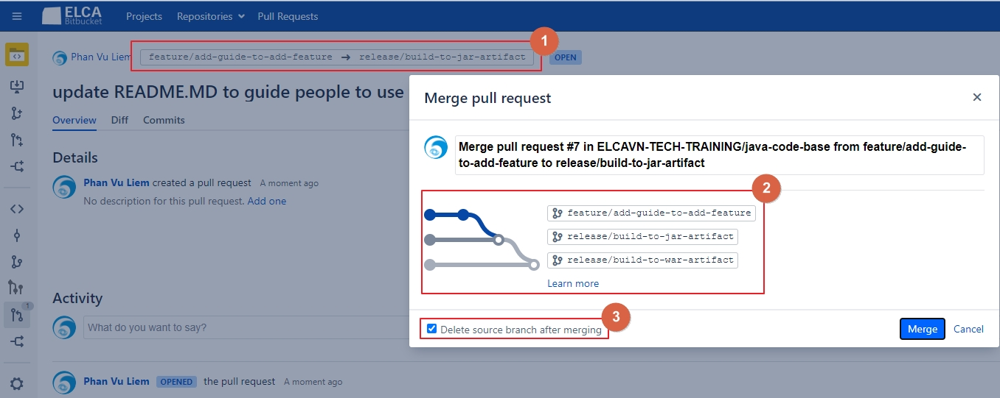
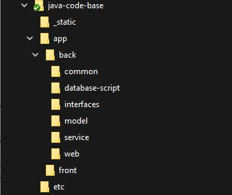

# Project Code base
This is the code base for ELCA VN JAVA projects. We have multiple release branches. Each branch is a feature you can add to the code base so that it can be most suitable to your project.
## 1. Use cases
### 1.1 Code base for new projects
The code base is designed like a small product with core features and multiple optional features. 
1. The core feature is on two main release branches: `release/build-to-jar-artifact` and `release/build-to-war-artifact`. Depends on the requirement of your project delivery (JAR or WAR) you will work with one of these branches. These branches are kept up-to-date together.
2. The optional feature is on the feature/* branches.  
3. The master branch is the base code. Usually only maintainers should work on this branch (e.g. update spring boot version, add common base feature,...)
#### To start your new project using code base
1. Select one of `release/build-to-jar-artifact` and `release/build-to-war-artifact` and then create a new branch (called as branch A) from it. (_Your new branch can be of any type any name you want. Because when things are done you need to delete it_)
2. Checkout branch A to your local computer.
3. Select and merge to A feature branches which match your needs.
4. When things are done, make sure you branch is built successfully with Maven. Make sure the demo can work as expected.
5. Copy the code to your project folder and then delete branch A.  
<b>NOTE</b>: we tried to build the feature/* branches in the way to avoid as much conflict as possible but in case you get issue. Please check or contact code base maintainer for support.

### 1.2 Maintaining code base with updated technology stacks
You should add tags for each library version on all the branche you update so that user can have an option to check-out their expected version.
Please make sure that all the branches are merged and fully test for compilation as well as runability so that the person who checks out the code won't be confused.
#### NOTE 
The repository is configured with "Auto merging enabled". This is because we have to maintain two branches : build to JAR and build to WAR in parallel. So, to make it easy we use the auto merge to keep the new feature updated for both branches. <br> 
In case you have issue with this mechanism you can temporarily disable it in `https://git.elcanet.local/plugins/servlet/branchmodel/projects/ELCAVN-TECH-TRAINING/repos/java-code-base` > `Enable automatic merging` and then merge the code yourself manually. After that please reenable this option again and make a test to make sure that the auto merging mechanism can still work for other people.
 
##### To add a new feature to code base for both WAR and JAR artifact
1. Create a new branch from `release/build-to-jar-artifact`.
2. Implement your new feature on this branch and then create a PR to `release/build-to-jar-artifact`.
3. You can see that the PR is automatically merge to `release/build-to-jar-artifact` and `release/build-to-war-artifact`. In case there is a conflict on any branch another PR will be created and you need to solve it. <br>
   Please check the picture below for detail
   
   <b>NOTE:</b> <br> 
   (1): where your branch should be merged to <br>
   (2): the flow shows how the code is merged. <br>
   (3): check on this branch in case this feature is not an optional independent so that the git tree is cleaned. <br>

##### To create an optional and independent new feature
1. Create a new branch from `release/build-to-jar-artifact` with type `feature/*`.
2. Implement your feature and then leave it like that. <b>DON'T MERGE TO BASE BRANCHES</b>  

## 2. Project structure 
The picture below illustrate the structure of the modules for backend. For the frontend, depends on the framework you choose: Angular / React the structure will be different. Please check the README in frontend dir of the corresponding branch for structure detail.


<strong>Explanation</strong> <br>
<strong>_static         </strong>: contains all the resources for all README.MD files. It's only for developer README.                                                                                                                                                                       <br>
<strong>app             </strong>: project code root dir which contains both backend and frontend code                                                                                                                                                                                       <br>
<strong>back            </strong>: project backend root dir                                                                                                                                                                                                                                  <br>
<strong>common          </strong>: contains common classes for backend such as Constants, Enums, Exceptions and Utilities which will be used by all other backend modules                                                                                                                    <br>
<strong>database-script </strong>: only contains DB scripts to initialize DB of the project. These scripts will be executed by Flyway/Liquibase                                                                                                                                              <br>
<strong>model           </strong>: contains all entities of the project                                                                                                                                                                                                     <br>
<strong>service         </strong>: contains all internal business/technical services of the whole project                                                                                                                                                                                    <br>
<strong>web             </strong>: where we expose WEB API endpoints from existing service methods for client (third party/frontend) to call                                                                                                                                                 <br>
<strong>front           </strong>: project frontend root dir                                                                                                                                                                                                                                 <br>
<strong>etc             </strong>: contains all other things which are not code but parts of the project build: docker image scripts, specific JARs of the project - which can't be downloaded from public repositories, performance test case, security exclusion, shared configuration,... <br>


## 3. Common installation for Development
Here we only list the common installation for the code base: maven, JDK, IntelliJ, Sonar
For more detail please check the README inside back / front module
### 3.1. Tools setup
1. Create project base folder at `c:\Projects\java-code-base`. We will call this path as `<PROJECT_DIR>` later
   You can change to your expected folder base later
   
2. Install necessary tools for development into `<PROJECT_DIR>\tools`
    - Download the tools from the following links : 
        1. Maven latest version: https://maven.apache.org/download.cgi
        2. OpenJDK 11: https://ci.elcanet.local/artifactory/prj_sso_generic_public/jdk/adoptopenjdk/11/windows/
		   Other versions can be downloaded at https://ci.elcanet.local/artifactory/prj_sso_generic_public/jdk/adoptopenjdk/
		   We use the OpenJDK versions hosted by ELCA (8 & 11) for safety and security. In case your use an older/newer version (e.g. JAVA 12,13 or Oracle JDK) please check and download directly from AdoptOpenJDK page or Oracle page.
    - Copy and unzip Maven into <PROJECT_DIR>\tools\apache-maven. Make sure the settings.xml file is updated with your username/password like this
	    ```
		 <server>
            <id>project-release</id>
            <username>your_visa</username>
            <password>your_password</password>
        </server>
        <server>
            <id>project-snapshot</id>
            <username>your_visa</username>
            <password>your_password</password>
        </server>
		```
    - Copy and unzip Java OpenJDK into `<PROJECT_DIR>\tools\openjdk-<version>`

3. IntelliJ setup
	- Make sure `File > Project Structure ... > Project Settings > Project` set Project SDK & language to the expected JDK you installed above and Project compiler output set to target folder of maven compiler.
	- Make sure the following plugins are installed:
		+ Sonarlint. Please also make sure that your project links to the Sonar server so that the rules set can be synched.
		+ Lombok (Please note that IntelliJ version `2020.2` is not compatible with version `0.30-2020.1`)
		+ MapStruct Support
	- Make sure that you enable Annotation processing for <strong>ALL the necessary modules</strong> in the project.
	    
### 3.2 Configure skeleton to use for your project 
#### 3.2.1 Update maven POMs
1. Replace `<groupId>` and `<artifactId>`, `<name>`, `<description>` in all modules with your project value
2. Update git URL in `<scm>`. This information is necessary for the maven plugin - buildnumber to get the git hash and version to update in MANIFEST.MF file when building project.
3. Update JAVA version and compiler version to your expected JDK.
4. Update Apache common libraries version to the latest if you want. This is recommended.
5. Update the version of the maven plugin if necessary. This is not recommended unless you know clearly what should be done because updating the plugin version sometime fails the build of the code because its behavior is changed. Some plugins are already defined in spring boot therefore we don't need to define the version again.
6. Update Sonar information for project. The following tags should be considered:
- `<sonar.profile>`: Sonar profile. Normally you should check if this value is still up-to-date.
- `<sonar.ldap.project>`: project key on Sonar server
- `<sonar.pullrequest.bitbucket.projectKey>`, `<sonar.pullrequest.bitbucket.repositorySlug>`: check with CH technical guy in case you don't know
- `<sonar.cpd.exclusions>`, `<sonar.coverage.exclusions>`, `<sonar.exclusions>`: you should update these tags in case your project has some different configurations
7. Update `<modules>` in case your project use a different structure
8. Uncomment the `<distributionManagement>` tags and replase the tags `<your_project_release_repository_name>` and `<your_project_snapshot_repository_name>` with your project value. These value can be checked at https://ci.elcanet.local/artifactory/webapp/#/artifacts/browse/tree/General/docker
9. Update the profile `vn-dev` with configuration of your DB so that the DB initializer tool can work correctly later.
 

## Common commands in the project
### Build project
`mvn clean install -DskipTests -Pvn-dev`

### Initialize DB
N/A

### Start docker containers locally
N/A
