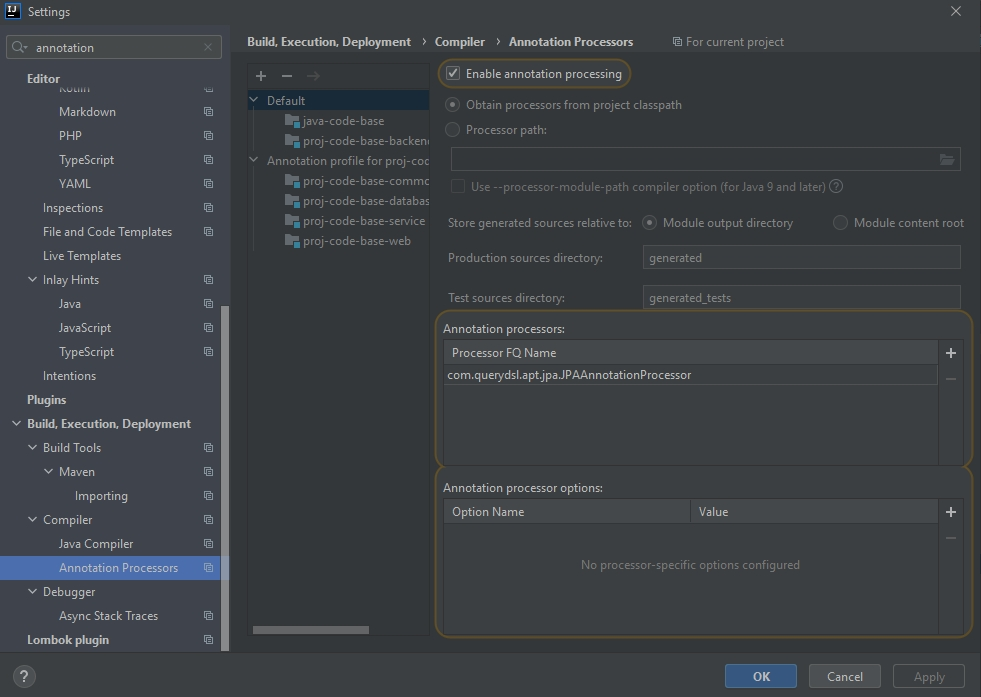

# Spring security exercise
## Tools setup
1. Create project base folder at `c:\Projects\java-code-base`. We will call this path as `<PROJECT_DIR>` later
   You can change to your expected folder base later
   
2. Install necessary tools for development into `<PROJECT_DIR>\tools`
    - Download the tools from the following links : 
        1. Maven latest version: https://maven.apache.org/download.cgi
        2. OpenJDK 11: https://ci.elcanet.local/artifactory/prj_sso_generic_public/jdk/adoptopenjdk/11/windows/
		   Other versions can be downloaded at https://ci.elcanet.local/artifactory/prj_sso_generic_public/jdk/adoptopenjdk/
		   We use the OpenJDK versions hosted by ELCA (8 & 11) for safety and security. In case your use an older/newer version (e.g. JAVA 12,13 or Oracle JDK) please check and download directly from AdoptOpenJDK page or Oracle page.

3. IntelliJ setup
	- Make sure `File > Project Structure ... > Project Settings > Project` set Project SDK & language to the expected JDK you installed above and Project compiler output set to target folder of maven compiler.
	- Make sure the following plugins are installed:
		+ Sonarlint. Please also make sure that your project links to the Sonar server so that the rules set can be synched.
		+ Lombok (Please note that IntelliJ version `2020.2` is not compatible with version `0.30-2020.1`)
		+ MapStruct Support
	- Make sure that you enable Annotation processing for <strong>ALL the necessary modules</strong> in the project.
	    
## Common commands in the project
### Build project
`mvn clean install -DskipTests -Pvn-dev`
### Run project
Create Spring boot configuration
- Main class : `vn.elca.codebase.CodeBaseDevModeWebApplication`
- Active profiles: `vn-dev`

## Exercise
1. Configuration a basic authentication mechanism using user from table User, then modify CodeBaseApiSecurityConfig so all requests in application requires authentication
Note: password of all users are "12345" and encrypted using bcrypt encoder, use BCryptPasswordEncoder to compare the password.
2. Modify CodeBaseApiSecurityConfig:
    1. User with authority 'READ' or 'WRITE' can call GET api
    2. Only user with authority 'WRITE' can call POST api
3. In UserService, using Global method security to config so method findAll and findOne: User without authority 'VIEW_OTHER_USERS' can only fetch its own user info.
4. Define 2 below filters:
    1. RequestValidationFilter: Called before authentication, check if request have value in header "Request-Id". If request doesn't have such value, stop the request and response HTTP Code 400.
    2. AuthenticationLoggingFilter: Called after authentication, log the Request-Id value in console log.
5. Testing: Create unittests to test feature in exercise 2 and 3.