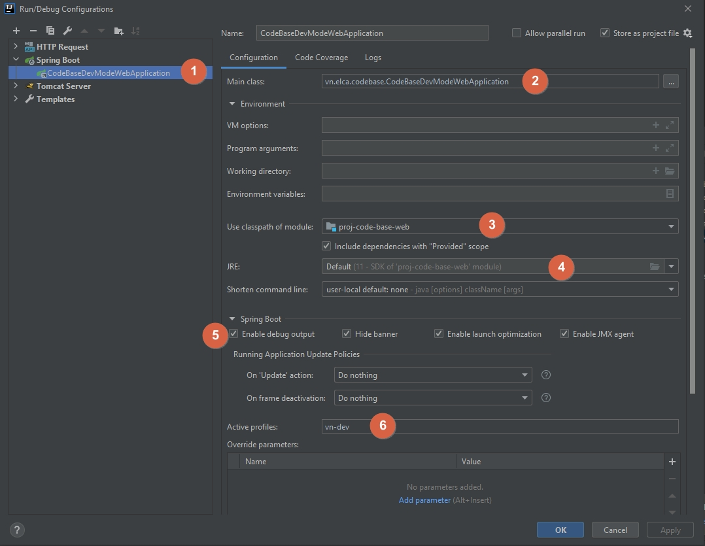

# Spring security OAuth2 exercise
## Tools setup
1. Create project base folder at `c:\Projects\java-code-base`. We will call this path as `<PROJECT_DIR>` later
   You can change to your expected folder base later
   
2. Install necessary tools for development into `<PROJECT_DIR>\tools`
    - Download the tools from the following links : 
        1. Maven latest version: https://maven.apache.org/download.cgi
        2. OpenJDK 11: https://ci.elcanet.local/artifactory/prj_sso_generic_public/jdk/adoptopenjdk/11/windows/
		   Other versions can be downloaded at https://ci.elcanet.local/artifactory/prj_sso_generic_public/jdk/adoptopenjdk/
		   We use the OpenJDK versions hosted by ELCA (8 & 11) for safety and security. In case your use an older/newer version (e.g. JAVA 12,13 or Oracle JDK) please check and download directly from AdoptOpenJDK page or Oracle page.

3. IntelliJ setup
	- Make sure `File > Project Structure ... > Project Settings > Project` set Project SDK & language to the expected JDK you installed above and Project compiler output set to target folder of maven compiler.
	- Make sure the following plugins are installed:
		+ Sonarlint. Please also make sure that your project links to the Sonar server so that the rules set can be synched.
		+ Lombok (Please note that IntelliJ version `2020.2` is not compatible with version `0.30-2020.1`)
		+ MapStruct Support
	- Make sure that you enable Annotation processing for <strong>ALL the necessary modules</strong> in the project.
	    
## Common commands in the project
### Build project
`mvn clean install -DskipTests -Pvn-dev`
### Run server:
Create Spring boot configuration
- Main class : `vn.elca.CustomerApplication`
### Run client
Create Spring boot configuration
- Main class : `vn.elca.codebase.CodeBaseDevModeWebApplication`
- Active profiles: `vn-dev`

## Exercise
1. Use project `client` to 
    - Setup a Feign client to call the server's api.
    - Deploy a fallback to handle in case server is not reachable or the api return error.
2. To test application, use the following api:
`http://localhost:8080/service/common/customers`
`http://localhost:8080/service/common/customers/{id}`
